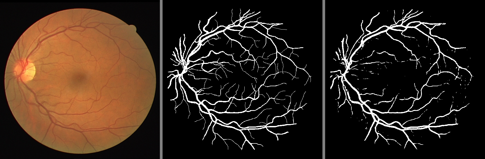
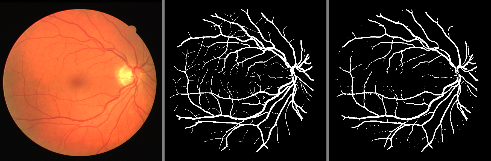
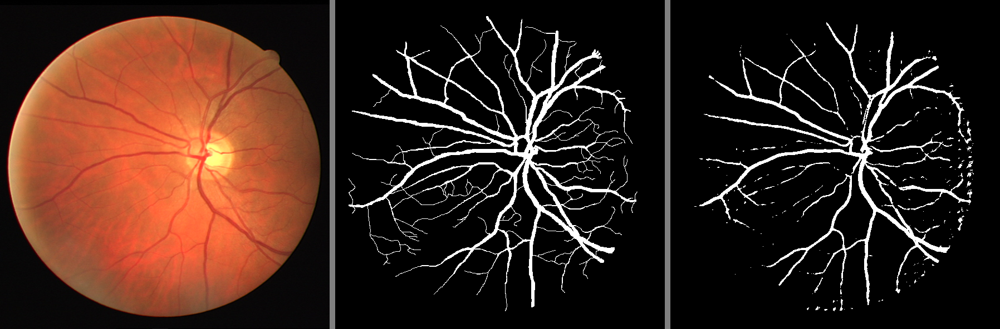

# Retinal Blood Vessel Segmentation using UNET & UNETR in PyTorch

This repository contains the code for semantic segmentation of the retinal blood vessel on the DRIVE dataset using UNET and UNETR architecture in PyTorch framework.
   

# Results

|  |
| :--: |
|  |
|  |
|  |
