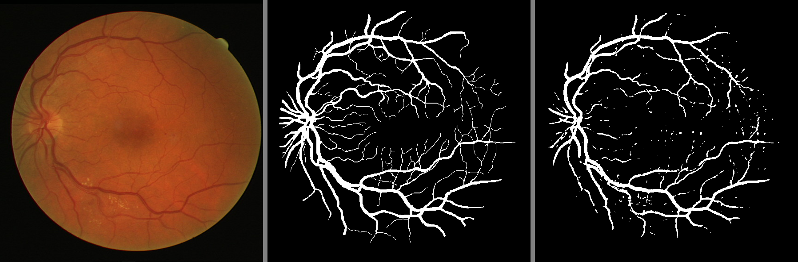

# Retina Blood Vessel Segmentation using UNET in PyTorch

This repository contains the code for semantic segmentation of the retina blood vessel on the DRIVE dataset using UNET and UNETR architecture in PyTorch framework.
   

# Results
The images below contains:
1. Input image
2. Ground truth 
3. Predicted mask

|  |
| :--: |
|  |
|  |
|  |
